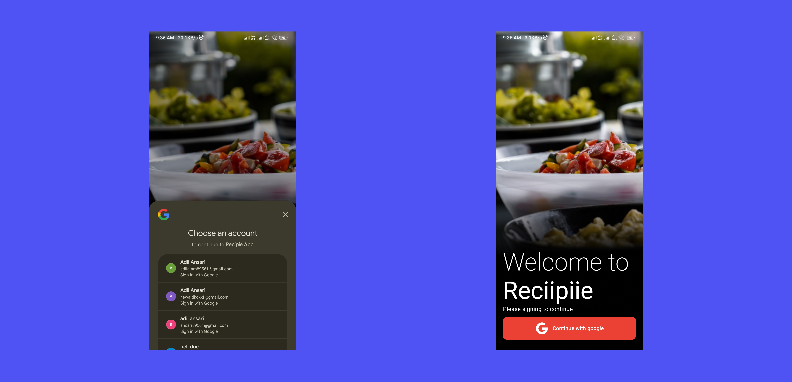

**You can use this app to find recipe and and save them on cloude and before make any dish go thought the nutrition list which you can you bottom of recipe view**

1. [Installation](#installation)
2. [Screen](#screen-short)
4. [Features](#feachers)
3. [Tecnology](#tecnologys-use)

## Installation
you can install akp of this app with going to this [release page](https://github.com/adil3811k/Recipie_App/releases/tag/Release) virsion of this app is still **1.0**. letter I will update as I update this app

## Features
* Login one tab singin with google sign in provider
* you can store you favorite recipe id on firebase firestore and view as you wish
* this as use [spoonacular](https://spoonacular.com/) food api to get data and diffrent endpoint.
* also you can search recipe app by typing on edit text and api type to suggest some recipes.
* also you can see good and bad nutrition  preticuler recipes.
* you can see this equipments Images and recipe Image.
## Screen Short
### Main Screern Short

### Login or Sing up Screen

## Tecnologys use
0. kotlin
1. Jetpack compse 
2. Retro fit
3. Clean  architecture (Manual dependency injection)
4. REST API
5. Firebase Firestore
6. google provider sign in(Firebase)
